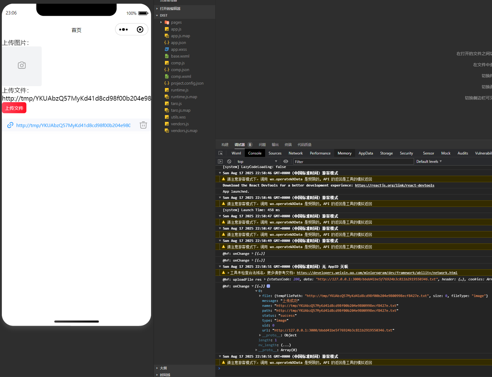

# @nutui/nutui-react-taro 问题3333复现仓库

问题链接：https://github.com/jdf2e/nutui-react/issues/3333

## 本地环境

- window 11
- node v22.18.0
- yarn 1.22.22
- bun 1.2.20

## 启动项目

```sh
# 启动前端
yarn
yarn dev:weapp

# 启动服务端
cd mini-server
bun install
bun run index.ts
```

## 页面预览


